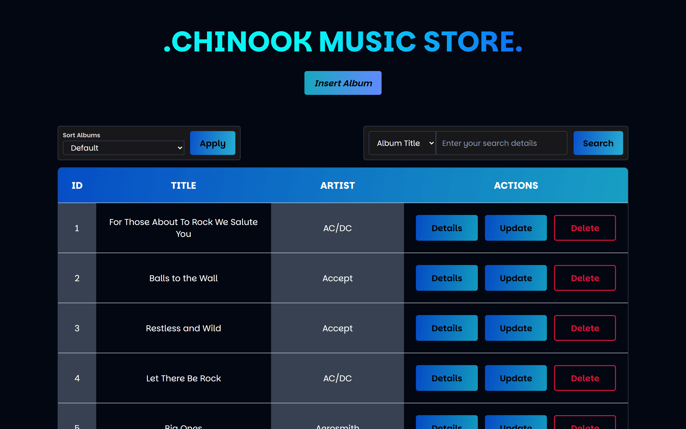
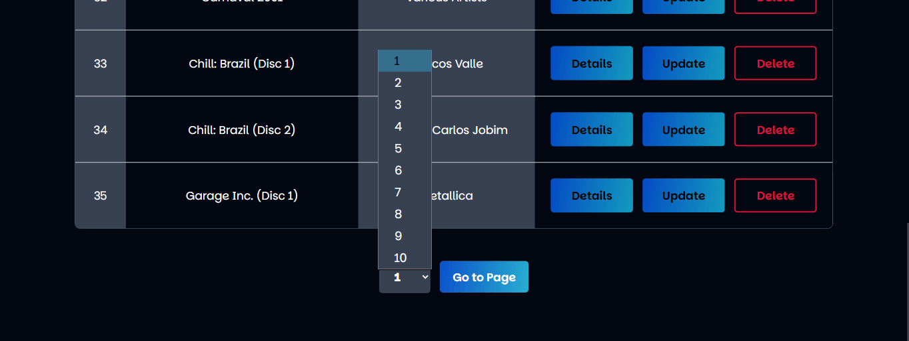
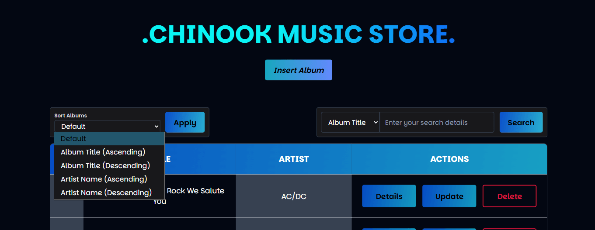
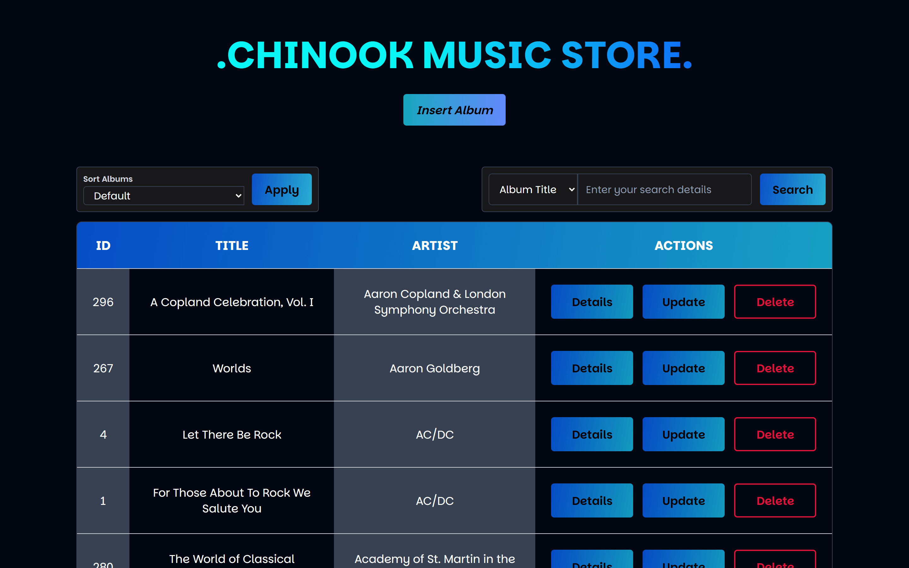

# CHINOOK MUSIC STORE

## Table of Contents

- [Overview](#overview)
- [Tools and Technologies](#tools-and-technologies)
- [Features](#features)
  - [View Albums](#view-albums)

## Overview

Welcome to the **Chinook Music Store** repository. This project is a **database-driven CRUD application** built to manage an online/digital music store. The Chinook database delivers a rich dataset and structure around which this project is built.

## Tools and Technolgies

This project is built using the following tools and technologies:

- **HTML5** and **CSS3** for the structure and user interface,
- **JavaScript** for interaction and behaviour,
- **PHP** for the logic, and
- **MySQL** for database management.

## Features

As a fully functional CRUD application, the Chinook Music Store web application showcases the fundamental functionalities for any CRUD application: **Create**, **Read**, **Update** and **Delete**.

The full scope of all features and functionalites for this project are as follows:

1. View albums
2. Album pagination
3. Sorting the list of albums
4. Searching the database
5. View single Album Details
6. Delete an Album and its tracks
7. Update existing album
8. Inserting a New album

### View Albums

When the Chinook Music Store homepage comes up, it shows the title of the web application, button to insert a new album, two forms that allow the user to sort through the list of albums or search for an album or artist. Below the forms, a table that show all the albums in the Chinook Music Store is also displayed.

In this table, the respective colums show the Album titles, the Artist names and actions (view details, update album information, delete album) that the user can carry out to manage these albums.

### Album Pagination

The Chinook Music Store database holds information of many albums, over 300 albums and viewing this on a single page is not user friendly with the endless scrolling so as an additional functionality, pagination is implemented for the table results. The user can select a page to load and on clicking the 'Go to Page' button, set of results with respect to that page get loaded.

### Sorting the list of albums

To facilitate ease of catalog management, albums and search results can be sorted in different ways. The ways implemented in the web application are as follows:

- Default: Sorts albums by their ID in the database
- Album Title (Ascending): Sorts albums table by the album titles in ascending order
- Album Title (Descending): Sorts albums table by the album titles in descending order
- Artist Name (Ascending): Sorts table by artist names in ascending order
- Artist Name (Descending): Sorts table by artist names in descending order

To implement this feature, after selecting an option, the user click the apply button to sort the table based on their choice.

The image below shows the table sorted by the artist names in ascending order.

### Searching the Database
