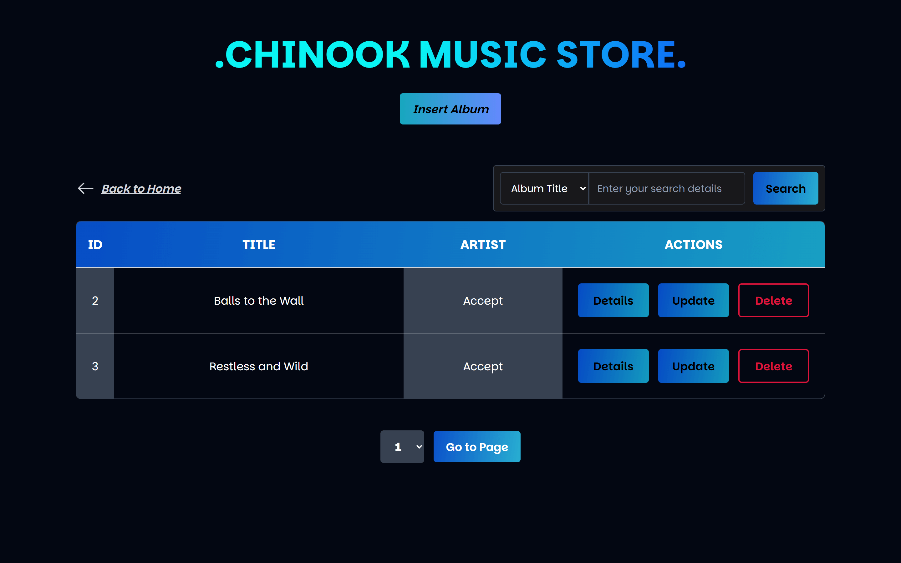
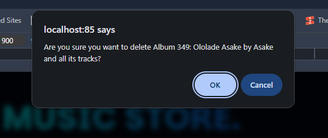

# CHINOOK MUSIC STORE

## Table of Contents

- [Overview](#overview)
- [Tools and Technologies](#tools-and-technologies)
- [Features](#features)
  - [View Albums](#view-albums)
  - [Album pagination](#album-pagination)
  - [Sorting the list of albums](#sorting-the-list-albums)
  - [Searching the database](#searching-the-database)
  - [View single Album Details](#view-single-album-details)
  - [Delete an Album and its tracks](#delete-an-album-and-its-tracks)
  - [Update existing album](#update-existing-album)
  - [Inserting a New album](#inserting-a-new-album)

## Overview

Welcome to the **Chinook Music Store** repository. This project is a **database-driven CRUD application** built to manage an online/digital music store. The Chinook database delivers a rich dataset and structure around which this project is built.

## Tools and Technolgies

This project is built using the following tools and technologies:

- **HTML5** and **CSS3** for the structure and user interface,
- **JavaScript** for interaction and behaviour,
- **PHP** for the logic, and
- **MySQL** for database management.

## Features

As a fully functional CRUD application, the Chinook Music Store web application showcases the fundamental functionalities for any CRUD application: **Create**, **Read**, **Update** and **Delete**.

The full scope of all features and functionalites for this project are as follows:

1. View albums
2. Album pagination
3. Sorting the list of albums
4. Searching the database
5. View single Album Details
6. Delete an Album and its tracks
7. Update existing album
8. Inserting a New album

### View Albums

When the Chinook Music Store homepage comes up, it shows the title of the web application, button to insert a new album, two forms that allow the user to sort through the list of albums or search for an album or artist. Below the forms, a table that show all the albums in the Chinook Music Store is also displayed.

In this table, the respective colums show the Album titles, the Artist names and actions (view details, update album information, delete album) that the user can carry out to manage these albums.

### Album Pagination

The Chinook Music Store database holds information of many albums, over 300 albums and viewing this on a single page is not user friendly with the endless scrolling so as an additional functionality, pagination is implemented for the table results. The user can select a page to load and on clicking the 'Go to Page' button, set of results with respect to that page get loaded.

On selecting page 10 and clicking the 'Go to Page' button, the result shown is as seen below

### Sorting the list of albums

To facilitate ease of catalog management, albums and search results can be sorted in different ways. The ways implemented in the web application are as follows:

- Default: Sorts albums by their ID in the database
- Album Title (Ascending): Sorts albums table by the album titles in ascending order
- Album Title (Descending): Sorts albums table by the album titles in descending order
- Artist Name (Ascending): Sorts table by artist names in ascending order
- Artist Name (Descending): Sorts table by artist names in descending order

To implement this feature, after selecting an option, the user click the apply button to sort the table based on their choice.

The image below shows the table sorted by the artist names in ascending order.

### Searching the Database

Another functionality implemented in the Chinook Music Store project is one that allows that user to filter through the list of albums in the database based on their search query. To use this feature, the user enters value in the search field as shown below and selects an option, whether to filter/search by Album Title or Artist name and on clicking the Search button, they get their search results.

On clicking the search button to search for Albums by Accept, here is the result

### Viewing Single Album Details

Now for each table row, under the actions column, the details button when clicked leads to another page that shows the user all the necessary information about the selected album.

On the details page, it shows the information about the Album like the Album title, Artist name and all the tracks under that album in a table. The table also shows, the track composer, length/duration, size, and unit price.

From the picture above, we can see the details for the album by AC/DC titled "For Those About To Rock We Salute You".

### Delete an Album and its tracks

To delete an album and its associated tracks, the delete button is available on each table row helps with that. On clicking the button, a popup window comes up for confirmation of the user choice. This is seen in the example below when the delete button is clicked for Album 349. In the popup window, the user knows which album was selected and the associated assist to confirm their decision.

If the user still goes ahead to click the delete button, another confirmation block pops up somewhat like two-factor authentication for deletion.

On confirming the delete option by selecting the OK button, the album and its tracks get deleted. The artist does not get deleted because that artist might still have another album in the database.

### Update existing album

Now, when a user wished to change or update the details of an album, the update button in the actions column on the table of albums can be used to do so. On clikcing this button, the user is directed to a page where they can change the details of an album. Some of these details include:

- Album title
- Artist name
- Track details
- Remove an existing track
- Add a new track to album

The image below shows how this works when we attempt to update album by AC/DC titled "For Those About To Rock We Salute You".

### Inserting a New album

The 'Insert Album' button is used to add a new album to the Chinook Music Store database.

On clicking this button, the user is directed to a page with a form with which they can enter the details of the album they wish to add to the database.

The information the user gets to add inludes:

- Album Title
- Artist name (the user can select from the list of artists available or enter a new artist name)
- Tracks for the album

From the image above, it is can be seen that the default state of the form only displays one (1) available track field. The 'Add Track' button at the bottom section of the form allows the user to add an extra form field which can be used to add a new track detail for the album. If the user decides to remove an extra track, they can use the 'X' button next to the input field as seen below

An extra feature to test how the insert functionality works is the 'Populate Form' button at the bbottom section of the form. Clicking this button populates the form with default album details that includes an Album Title called 'Work of Art' by 'Asake' which includes fourteen (14) tracks.

After the user may have inputed all the necesary details for an album, they can go ahead to click the Insert Album button to submit the form and add the album as a new entry into the database.
